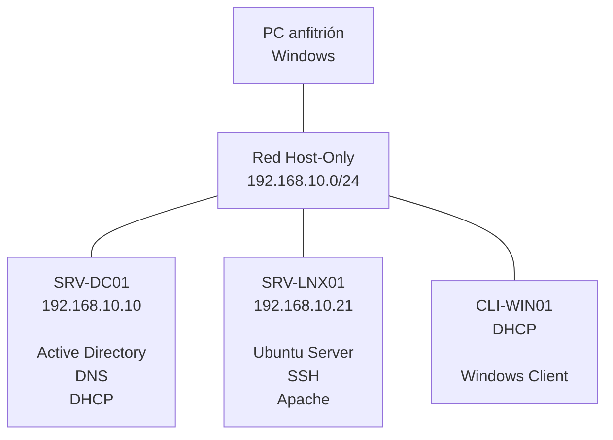

# Homelab - Infraestructura IT Empresarial

Laboratorio de infraestructura IT virtualizada diseñado para simular el entorno tecnológico de una pequeña empresa.

El proyecto tiene como objetivo poner en práctica conocimientos de **administración de sistemas, redes, servidores, servicios de infraestructura y virtualización**, mediante la implementación y configuración de diferentes máquinas virtuales conectadas en una red interna.

## Objetivos

* Diseñar una infraestructura IT virtualizada.
* Implementar Windows Server como servidor de infraestructura.
* Implementar un dominio mediante Active Directory.
* Configurar y administrar DNS.
* Implementar un servidor DHCP.
* Administrar usuarios, grupos y unidades organizativas.
* Aplicar políticas mediante GPO.
* Integrar un cliente Windows en el dominio.
* Implementar un servidor Linux.
* Configurar acceso remoto mediante SSH.
* Implementar un servicio web mediante Apache.
* Configurar la resolución de nombres entre los diferentes sistemas.
* Comprobar la conectividad y el funcionamiento de los servicios.
* Documentar el proceso de implementación y las pruebas realizadas.

## Tecnologías

* **VirtualBox** — Virtualización
* **Windows Server 2019** — Servidor de infraestructura
* **Windows** — Cliente
* **Ubuntu Server 20.04** — Servidor Linux
* **Active Directory Domain Services (AD DS)**
* **DNS**
* **DHCP**
* **Group Policy (GPO)**
* **OpenSSH**
* **Apache**
* **Git**
* **GitHub**

## Arquitectura



### Direccionamiento

| Equipo      | Sistema             | Dirección IP    | Función                         |
| ----------- | ------------------- | --------------- | ------------------------------- |
| `SRV-DC01`  | Windows Server 2019 | `192.168.10.10` | Active Directory, DNS y DHCP    |
| `SRV-LNX01` | Ubuntu Server 20.04 | `192.168.10.21` | SSH y Apache                    |
| `CLI-WIN01` | Windows             | DHCP            | Cliente integrado en el dominio |

### Red

```text
Red:                 192.168.10.0/24
Dominio:             adlab.local
SRV-DC01:            192.168.10.10
SRV-LNX01:           192.168.10.21
Rango DHCP:          192.168.10.20 - 192.168.10.100
```

## Infraestructura implementada

### Windows Server — `SRV-DC01`

`SRV-DC01` actúa como servidor principal de la infraestructura.

Se han implementado:

* Active Directory Domain Services.
* Dominio `adlab.local`.
* DNS.
* DHCP.
* Usuarios y grupos.
* Unidades organizativas.
* Políticas de grupo (GPO).
* Administración centralizada de los equipos del dominio.

### DHCP

Se ha configurado un ámbito DHCP para proporcionar automáticamente configuración de red a los clientes.

```text
Ámbito:              LAB-AD
Red:                 192.168.10.0/24
Rango:               192.168.10.20 - 192.168.10.100
Máscara:             255.255.255.0
Servidor DNS:        192.168.10.10
Dominio:             adlab.local
```

### Cliente Windows — `CLI-WIN01`

Se ha configurado un equipo cliente Windows para:

* Obtener su dirección IP mediante DHCP.
* Utilizar el DNS del controlador de dominio.
* Integrarse en el dominio `adlab.local`.
* Autenticarse mediante Active Directory.
* Aplicar las políticas configuradas mediante GPO.

### Servidor Linux — `SRV-LNX01`

Se ha implementado un servidor **Ubuntu Server 20.04** con dirección:

```text
192.168.10.21
```

Se han configurado los siguientes servicios:

* **OpenSSH** para administración remota.
* **Apache** como servidor web.
* Integración con la infraestructura DNS del laboratorio.

## Pruebas realizadas

Durante la implementación se han realizado diferentes comprobaciones para validar el funcionamiento de la infraestructura:

* Conectividad entre las máquinas mediante `ping`.
* Resolución de nombres mediante DNS.
* Obtención automática de direcciones IP mediante DHCP.
* Comprobación de concesiones DHCP.
* Integración del cliente Windows en el dominio.
* Comprobación del servidor de inicio de sesión mediante `LOGONSERVER`.
* Administración remota de `SRV-LNX01` mediante SSH.
* Comprobación del servicio Apache.
* Resolución DNS de `SRV-LNX01`.

## Documentación

La documentación del proyecto contiene las diferentes fases de instalación, configuración y validación de la infraestructura.

```text
screenshots/
├── active-directory/
└── linux/
```

Las capturas muestran las configuraciones realizadas y las pruebas utilizadas para validar el funcionamiento de los diferentes componentes.

## Estado del proyecto

🟢 **Finalizado**

La infraestructura base del laboratorio ha sido implementada y validada.

El proyecto incluye:

* Virtualización mediante VirtualBox.
* Windows Server.
* Active Directory.
* DNS.
* DHCP.
* Cliente Windows integrado en el dominio.
* Ubuntu Server.
* SSH.
* Apache.
* Comunicación entre los diferentes sistemas.
* Documentación y evidencias mediante capturas.

### Mejoras futuras

Como posibles ampliaciones del laboratorio se podrían incorporar:

* Monitorización mediante PRTG.
* Automatización mediante PowerShell.
* Automatización mediante Bash.
* Copias de seguridad automatizadas.
* Refuerzo de la seguridad de Windows y Linux.
* Centralización y análisis de logs.

Estas funcionalidades quedan fuera del alcance de la versión actual del proyecto.

## Autor

**Daniel Pérez**
