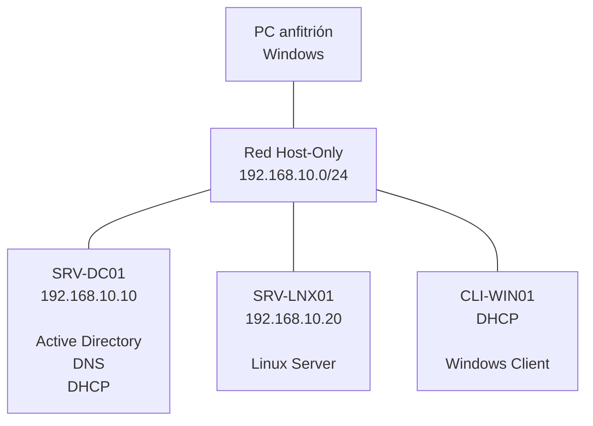

# Homelab - Infraestructura IT Empresarial

Laboratorio de infraestructura IT virtualizada diseñado para simular el entorno tecnológico de una pequeña empresa.

El proyecto tiene como objetivo poner en práctica conocimientos de administración de sistemas, redes, servidores, monitorización, seguridad y automatización.

## Objetivos

- Diseñar una infraestructura IT virtualizada.
- Implementar Windows Server y Active Directory.
- Configurar DNS y DHCP.
- Administrar usuarios, grupos y equipos.
- Aplicar políticas mediante GPO.
- Implementar un servidor Linux.
- Configurar servicios de red y aplicaciones.
- Implementar monitorización.
- Automatizar tareas administrativas.
- Implementar copias de seguridad.
- Documentar procedimientos y resolución de incidencias.

## Tecnologías

Actualmente en planificación:

- VirtualBox
- Windows Server
- Windows
- Linux
- Active Directory
- DNS
- DHCP
- PowerShell
- Bash
- Git
- GitHub

## Arquitectura

## Documentación

La documentación se incorporará progresivamente a medida que se implementen y validen los diferentes componentes de la infraestructura.

## Estado del proyecto

🟡 En desarrollo

## Autor

Daniel Pérez
