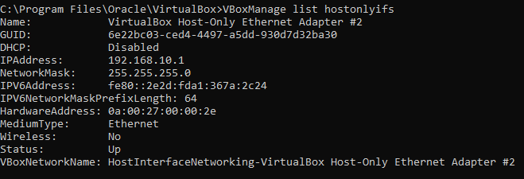

# 02 - Configuración de red virtual

## Objetivo

Crear una red privada Host-Only en VirtualBox para permitir la comunicación
entre las máquinas virtuales del laboratorio y el equipo anfitrión.

## Configuración

Se ha utilizado la interfaz:

VirtualBox Host-Only Ethernet Adapter #2

Parámetros configurados:

- Dirección IPv4 del host: 192.168.10.1
- Máscara de red: 255.255.255.0
- Red: 192.168.10.0/24
- DHCP de VirtualBox: desactivado
- Estado: activo

## Justificación

El DHCP de VirtualBox se ha desactivado porque posteriormente el servidor
Windows Server del laboratorio (`SRV-DC01`) proporcionará el servicio DHCP
a los equipos cliente.

La interfaz Host-Only proporciona una red privada para la comunicación
entre el equipo anfitrión y las máquinas virtuales del laboratorio.

## Verificación

La configuración se ha comprobado mediante:

```cmd
VBoxManage list hostonlyifs
```

Resultado esperado:

```text
IPAddress:       192.168.10.1
NetworkMask:     255.255.255.0
DHCP:            Disabled
Status:          Up
```

## Evidencia


