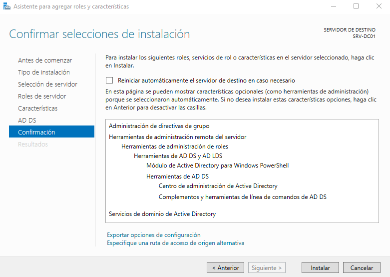
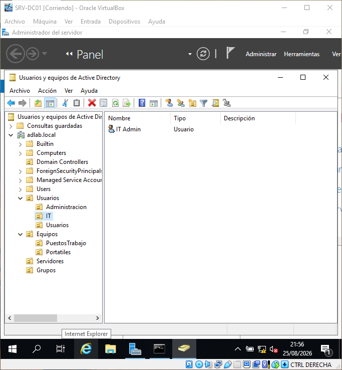
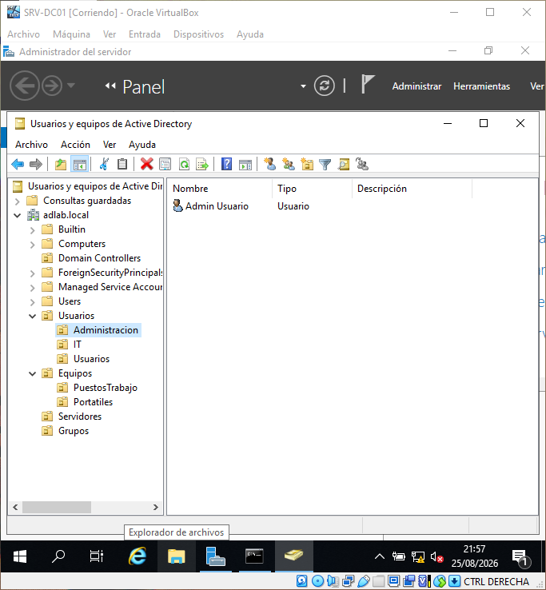
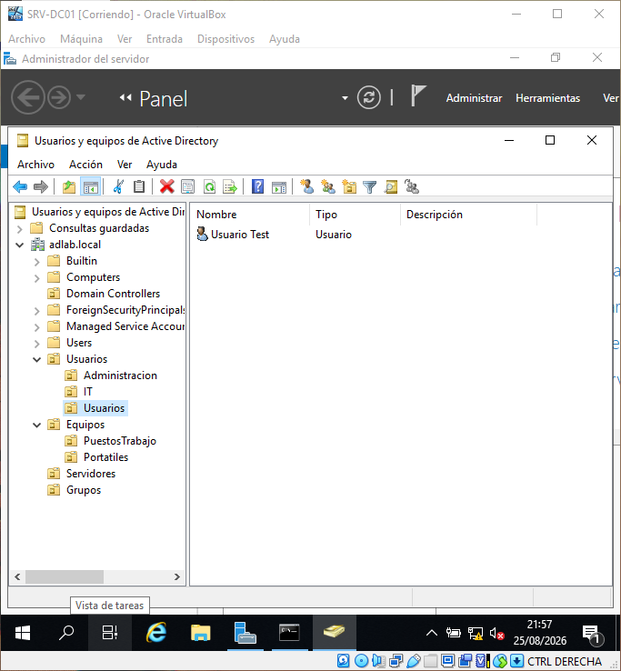
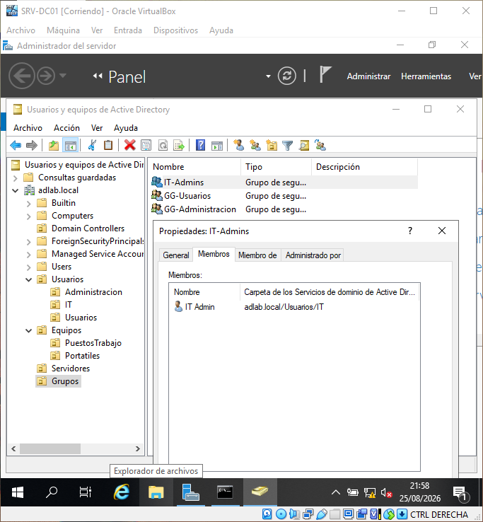
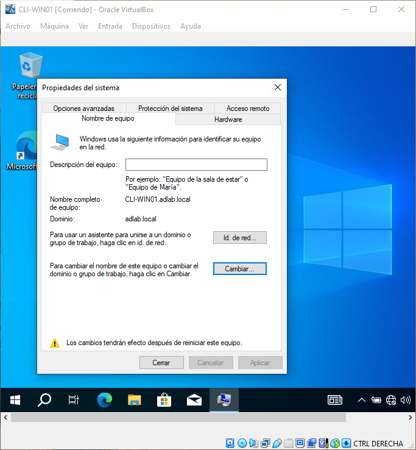
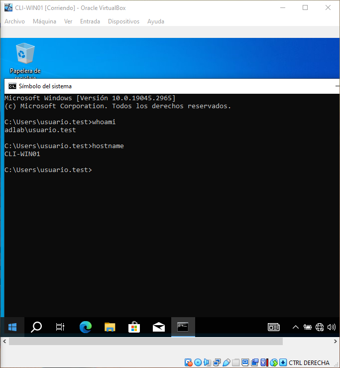
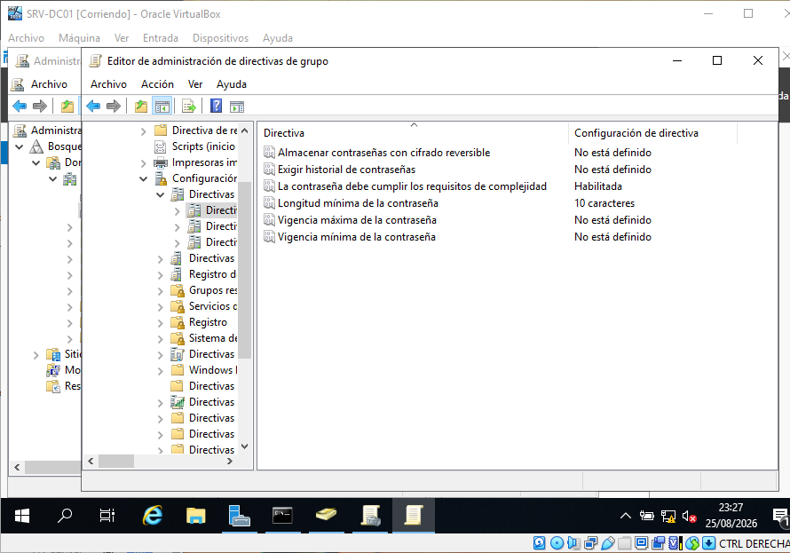
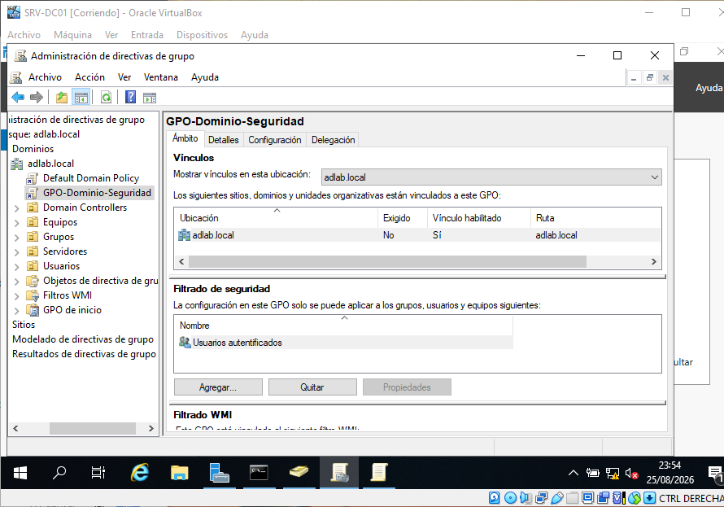
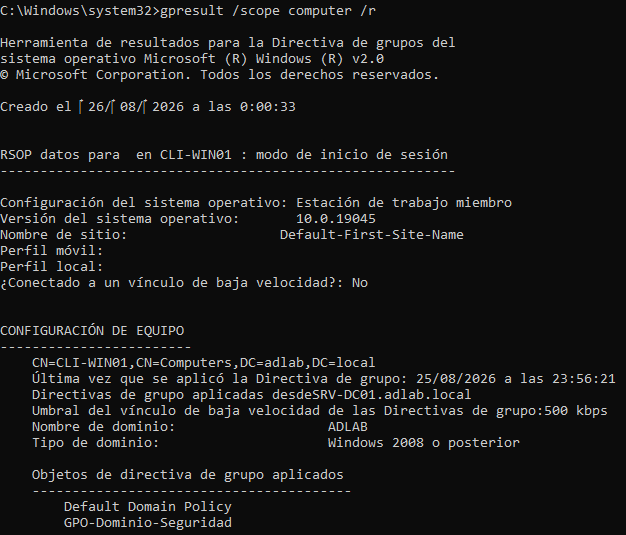

# Evidencias de Active Directory

Esta sección contiene las evidencias relacionadas con la instalación,
configuración y administración de Active Directory Domain Services (AD DS)
en el servidor `SRV-DC01`.

## Servidor

- **Hostname:** `SRV-DC01`
- **Sistema operativo:** Windows Server 2019
- **Dirección IPv4:** `192.168.10.10`
- **Red:** `192.168.10.0/24`

## Evidencias

### 08 — Instalación de Active Directory Domain Services

Asistente de Windows Server preparado para instalar el rol de Servicios de dominio de Active Directory (AD DS).


## Objetivos

La infraestructura de Active Directory tendrá como objetivos:

- Crear un dominio para el laboratorio.
- Configurar `SRV-DC01` como controlador de dominio.
- Proporcionar DNS mediante Active Directory.
- Crear una estructura de Unidades Organizativas (OU).
- Crear usuarios y grupos.
- Aplicar Directivas de Grupo (GPO).
- Integrar posteriormente equipos cliente Windows en el dominio.

## Estructura de Unidades Organizativas

El dominio `adlab.local` utiliza una estructura de Unidades Organizativas (OU)
para separar usuarios, equipos, servidores y grupos.

```text
adlab.local
├── Usuarios
│   ├── Administracion
│   ├── IT
│   └── Usuarios
├── Equipos
│   ├── PuestosTrabajo
│   └── Portatiles
├── Servidores
└── Grupos
```

## Grupos de seguridad

Se han creado grupos de seguridad para facilitar la administración de permisos
y la aplicación de políticas de grupo.

| Grupo | Tipo | Ámbito | Propósito |
|---|---|---|---|
| `IT-Admins` | Seguridad | Global | Administradores del área de TI |
| `GG-Usuarios` | Seguridad | Global | Usuarios estándar del dominio |
| `GG-Administracion` | Seguridad | Global | Usuarios del área de administración |

La utilización de grupos permite evitar asignar permisos individualmente a
cada usuario y facilita la administración de la infraestructura.

## Seguridad

Las capturas y documentación no deben contener:

- Contraseñas.
- Claves de producto.
- Tokens o credenciales.
- Información personal real.
- Otros secretos de configuración.

Las cuentas y credenciales utilizadas en el laboratorio serán exclusivamente
de prueba.

## Usuarios de prueba

Se han creado tres cuentas de usuario para validar la administración del
dominio y la pertenencia a grupos de seguridad.

| Usuario | OU | Grupo |
|---|---|---|
| `it.admin` | `Usuarios/IT` | `IT-Admins` |
| `admin.usuario` | `Usuarios/Administracion` | `GG-Administracion` |
| `usuario.test` | `Usuarios/Usuarios` | `GG-Usuarios` |

Las cuentas se utilizan exclusivamente para las pruebas del laboratorio.

### Usuarios creados

#### Usuario de IT

El usuario `it.admin` se encuentra dentro de la OU `Usuarios/IT`.



#### Usuario de Administración

El usuario `admin.usuario` se encuentra dentro de la OU `Usuarios/Administracion`.



#### Usuario estándar

El usuario `usuario.test` se encuentra dentro de la OU `Usuarios/Usuarios`.



### Pertenencia a grupos

Se ha comprobado la pertenencia del usuario `it.admin` al grupo de seguridad
`IT-Admins`.



## Unión del cliente al dominio

El equipo `CLI-WIN01` fue configurado con la dirección `192.168.10.20` y
utiliza `SRV-DC01` (`192.168.10.10`) como servidor DNS.

Posteriormente, `CLI-WIN01` se incorporó correctamente al dominio
`adlab.local`.

### Pertenencia al dominio



### Autenticación de usuario del dominio

Se verificó el inicio de sesión utilizando la cuenta `adlab\usuario.test`.



## Directivas de Grupo

Se creó la GPO `GPO-Dominio-Seguridad` para establecer una política básica de
seguridad de contraseñas en el dominio.

La política establece una longitud mínima de contraseña de 10 caracteres y
mantiene habilitados los requisitos de complejidad.

### Política de contraseñas



## Directivas de Grupo

Se creó la GPO `GPO-Dominio-Seguridad` para establecer una política básica de
seguridad de contraseñas en el dominio `adlab.local`.

La política establece una longitud mínima de contraseña de 10 caracteres y
mantiene habilitados los requisitos de complejidad.

### Vinculación de la GPO

La GPO se vinculó al dominio `adlab.local` y se habilitó su vínculo, utilizando
`Usuarios autenticados` como filtrado de seguridad.



### Aplicación de la GPO

En `CLI-WIN01` se utilizó `gpupdate /force` y posteriormente `gpresult` para
comprobar que `GPO-Dominio-Seguridad` se aplica correctamente al equipo
cliente.


