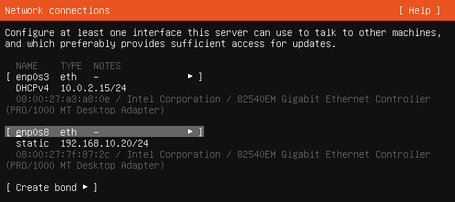

# Linux Server 

Esta carpeta contiene las capturas correspondientes a la instalación y configuración inicial del servidor Linux `SRV-LNX01`.

### 38 — Instalación de Ubuntu Server

La máquina virtual se ha configurado con:

- 2 GB de RAM.
- 2 procesadores virtuales.
- 25 GB de almacenamiento.
- Ubuntu Server 20.04.

---

## 39 — Configuración de red

**Archivo:** `39-ubuntu-network.png`

Captura de la configuración de red de `SRV-LNX01`.

El servidor dispone de dos interfaces de red:

- `enp0s3` → NAT, utilizada para acceso a Internet y actualizaciones.
- `enp0s8` → Host-Only, utilizada para la comunicación con la red interna del laboratorio.

Configuración de la interfaz interna:

- Dirección IP: `192.168.10.20/24`
- DNS: `192.168.10.10`
- Dominio de búsqueda: `adlab.local`
- Gateway: sin configurar.

La red interna utiliza el direccionamiento `192.168.10.0/24`.
