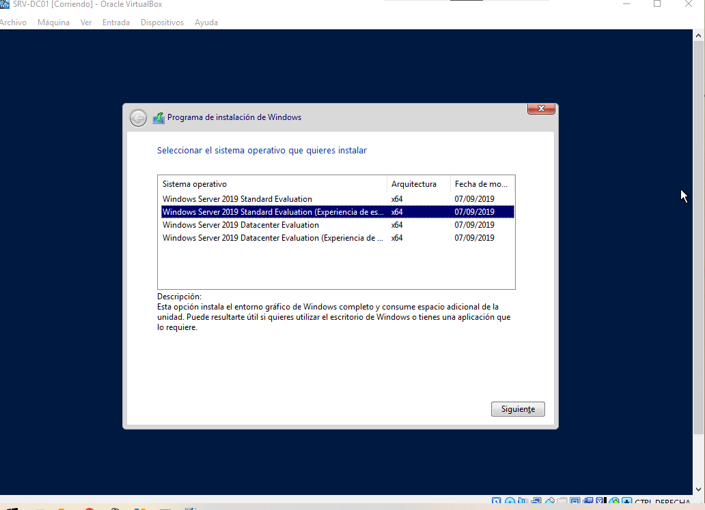
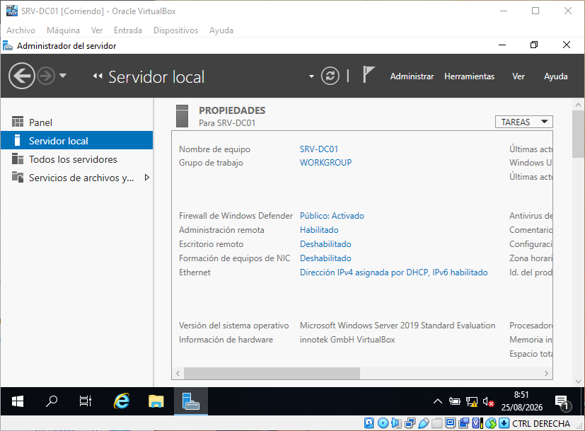

# Evidencias de Windows Server

Esta sección contiene las capturas de pantalla que documentan la instalación,
configuración y administración de `SRV-DC01`, el servidor Windows principal
del laboratorio.

## Evidencias

### 03 — Edición de Windows Server

Edición de Windows Server 2019 seleccionada durante la instalación.

### 04 — Nombre del servidor

Nombre de equipo configurado como `SRV-DC01`.

## Convenciones

Las capturas se almacenan siguiendo una numeración correlativa y describen
los principales hitos de configuración del servidor.

Se evitarán capturas que contengan contraseñas, credenciales, claves de
producto u otra información sensible.
